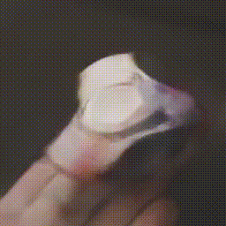
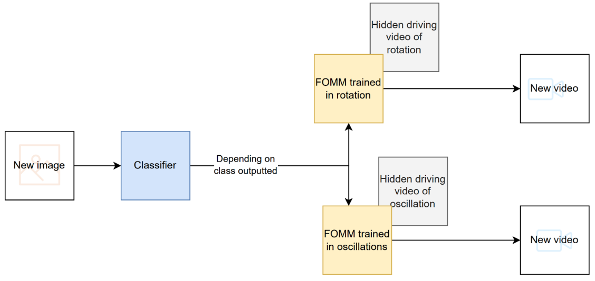

<div align="center">

# Animating Foreground Objects on a Single Image
<h3 align="center"> ML703 - Probabilistic and Statistical Inference </h3>
  
</div>

<p align="center">
   
   
</p>

## Description
We present a model which receives a single image as input and animates that object. We focus on two types of motions: rotation and oscillation. The pipeline of our model is presented below. Please refer to the paper for further details.

## Project pipeline
<p align="center">
  
</p>

## Installation
Run the code below to install the required libraries for this project:

```yaml
# clone project
git clone https://github.com/bermudezarii/ML_703_Animating_objects_application
cd ML_703_Animating_objects_application

# create conda environment with necessary libraries
conda env create --name your_env_name --file environment.yml
conda activate your_env_name
```

## Project Files Description
<ul>
  <li>main.py - script to train models and generate images, check section DEMO below </li>
  <li>model - folder consisting original codes of First-Order Motion Model, Thin-Plate Spline Model, EfficientNetB4 classifier</li>
  <li>dataset - folder consisting our own dataset, collected for this project</li>
  <li>assets - folder containing source images and hidden driving videos of our results</li>
  <li>results - resulting videos generating according to conditions mentioned in the paper</li>
</ul>

## Demo 
First please download the weight from <a href = 'https://mbzuaiac-my.sharepoint.com/:f:/g/personal/ariana_venegas_mbzuai_ac_ae/ErItB9PBpGdKivIHA_Q8otcBwE-q9euuQ5gkkeSe8DhFdw?e=iZWanl'> OneDrive </a> and put them into checkpoint folders inside the corresponding models. <br>
<br>
### Training
Since our classifier is used for the proof of concept, we skip training this model and provide our own weights.
For each model and each motion we do separate trainings. Run the codes below to train all the models:
```yaml
#Train FOMM rotation:
python -c 'from main import *; train_FOMM_rotation()'

#Train FOMM periodic:
python -c 'from main import *; train_FOMM_periodic()’

#Train TPSM rotation:
python -c 'from main import *; train_TPSM_rotation()'

#Train TPSM periodic:
python -c 'from main import *; train_TPSM_periodic()’
```
On RTX6000 each training takes around 24 hours to complete.

### Image generation
To generate images run the following commands. You need to provide the path to source image and checkpoint if you trained models by yourself. You don't need to specify path to checkpoint if you're using our pretrained weights. 

```yaml
#Generate FOMM rotation:
python -c 'from main import *; generate_FOMM_rotation({PATH_TO_IMAGE}, {PATH_TO_CHECKPOINT})’

#Generate FOMM periodic:
python -c 'from main import *; generate_FOMM_periodic({PATH_TO_IMAGE}, {PATH_TO_CHECKPOINT})’

#Generate TPSM rotation:
python -c 'from main import *; generate_TPSM_rotation({PATH_TO_IMAGE}, {PATH_TO_CHECKPOINT})’

#Generate TPSM periodic:
python -c 'from main import *; generate_TPSM_periodic({PATH_TO_IMAGE}, {PATH_TO_CHECKPOINT})’
```

## Datasets
Our dataset can be accessed both in this repo and in <a href = 'https://drive.google.com/drive/folders/1kQgN5CnrO3JNCB1y_C7u0jPFqi15vz6C'>Google Drive</a>
